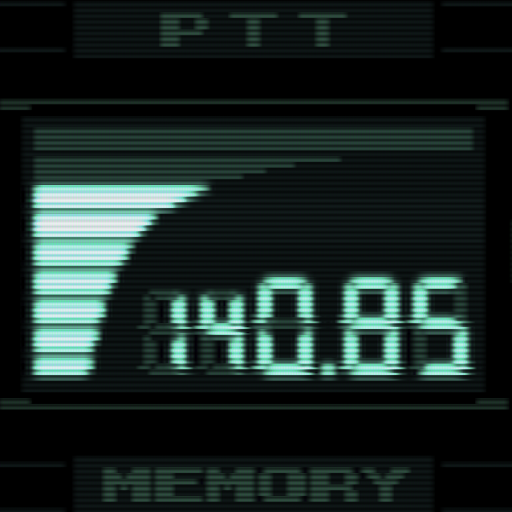

# MGS1 Translation Toolkit

A PySide6 desktop application for editing Metal Gear Solid 1 subtitle data. Built to create an "undubbed" version of MGS1 — English subtitles injected into the Japanese version to preserve the original Japanese voice acting.



## Features

- **Four editor modes**: RADIO (codec calls), DEMO (cutscenes), VOX (voice clips), ZMOVIE (FMV subtitles)
- **Audio/video playback** with synced subtitle preview overlay
- **Original/Altered split** — edits are tracked separately from extracted data; unchanged entries are never touched during recompile, preserving original Japanese text
- **Project files (.mtp)** — save and restore all work across sessions
- **Font Editor** — view, replace, and export MGS1 font glyphs; load custom .tbl character mappings
- **Finalize Project** — batch-compile all game data formats in one step
- **Auto-format** — pixel-width-aware line wrapping using MGS1's actual font metrics
- **Translation helper** — built-in Google Translate integration for rough drafts

## Quick Start

### Requirements

- Python 3.8+
- Git (for submodule)
- ffmpeg (for audio playback)

### Launch

```bash
# macOS / Linux
./launch.sh

# Windows
launch.bat
```

The launch script handles everything on first run — creates a virtual environment, installs dependencies, initializes the scripts submodule, and starts the app.

### Manual Setup

```bash
python -m venv .venv
source .venv/bin/activate   # Windows: .venv\Scripts\activate
pip install -r requirements.txt
git submodule update --init --recursive
pip install -r scripts/requirements.txt
python src/mainwindow.py
```

## Workflow

1. **Open Folder** — point to a directory containing RADIO.DAT, DEMO.DAT, VOX.DAT, and/or ZMOVIE.STR
2. **Edit** — browse entries, select subtitles, edit text and timing
3. **Save Project** — saves your work as an .mtp file (ZIP archive)
4. **Finalize** — compile edited data back to game formats for testing

Only modified entries are included in compiled output. Unedited entries keep their original binary data byte-for-byte.

## Project Structure

```
mgs-undubbed-gui/
├── launch.sh / launch.bat    # Launch scripts (auto-setup)
├── requirements.txt
├── scripts/                   # mgs1-scripts submodule (CLI tools)
├── src/
│   ├── mainwindow.py          # Main application
│   ├── form.ui / ui_form.py   # Qt Designer UI
│   └── icon.png
├── FEATURES.md                # Full feature list and roadmap
└── FONT_EDITOR.md             # Font Editor user guide
```

## Known Issues

- **VOX size changes crash RADIO playback** — if VOX subtitle edits change the block size of a clip, the corresponding VOX_CUES entries in RADIO.DAT still reference the old block counts. Playing that codec call in-game will crash. A fix to automatically sync VOX block lengths into RADIO.DAT is planned but not yet implemented.

- **Recompiler pipeline incomplete** — the full recompile-to-ISO pipeline is not yet end-to-end tested across all four formats. Some edge cases in the text encoder may produce incorrect output for certain Japanese character sequences.

- **Integral disc unknown chunks** — loading DEMO.DAT or VOX.DAT from the Integral/VR Missions disc may fail due to unrecognized chunk types in the data. A fix is pending in the scripts submodule.

**Translation work is safe to begin.** The .mtp project file format is stable, and your edits are preserved separately from the original data. Even as the recompiler improves, your saved work will carry forward.

## Credits

Built with [PySide6](https://doc.qt.io/qtforpython-6/) and the [mgs1-scripts](https://github.com/drsparklegasm/mgs1-scripts) toolkit.

Big thanks to Green_goblin, Iseeeva, TEAM_FOXDIE for their reversing efforts, and many others. 

Also, most of this is vibe coded by Claude because I really couldn't be bothered to make a GUI, but folks will be more comfortable here than with command line. 